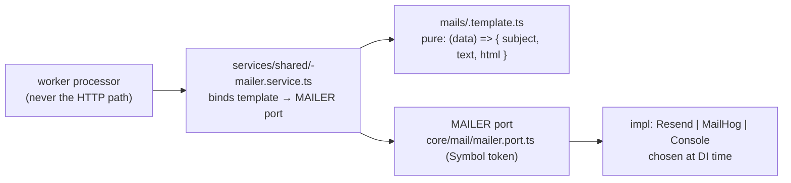

# Mail

> Reviewed: `core/mail`, `auth/mails` + `services/shared` (waves 1–2). See `REVIEW.md` D18.

## Shape

## Rules

| # | Rule | Reference |
|---|---|---|
| ML1 | Rendering is a **pure function** in `<module>/mails/<x>.template.ts` returning `{ subject, text, html }` — no side effects. | `auth/mails/challenge-email.template.ts:11-21` |
| ML2 | The `services/shared/<x>-mailer.service.ts` binds the template to the `MAILER` port and is invoked from a **worker processor**, never an HTTP path. | `auth/services/shared/challenge-mailer.service.ts` |
| ML3 | The mailer impl is chosen at DI time by `mailer.provider.ts`: `RESEND_API_KEY` → Resend; else `MAIL_USE_MAILHOG=true` → MailHog SMTP; else `ConsoleMailerService` (and a bootstrap throw in production). | `core/mail/mailer.provider.ts` |
| ML4 | Structured params/results as named interfaces, not positional args. | `auth/services/shared/challenge-mailer.service.ts:5-8` |

## D18 — fallback (done, Batch A)

The no-key fallback is **`ConsoleMailerService`** (logs a clear warning);
production **throws at bootstrap** when neither `RESEND_API_KEY` nor the explicit
`MAIL_USE_MAILHOG=true` opt-in is set. MailHog is no longer a silent default that
drops mail into a dead SMTP in a misconfigured prod.

## Tests (done, Batch I)

`test/fakes/mailer.fake.ts` — canonical `FakeMailer implements Mailer` (records
`sent`, `nextError` to throw once). `ChallengeMailerService` has a direct unit
spec (`services/shared/challenge-mailer.service.spec.ts`): template render + send
through `FakeMailer`, and transport-error propagation. `send-challenge-email`
processor also spec'd.
