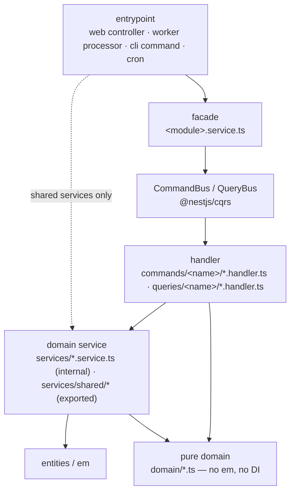

# Architecture — module anatomy & layering

> Reviewed: `auth`, `post` (wave 1); `learning`, `billing`, `telegram`, entrypoints (wave 2).
> Baseline: `src/modules/auth`.

## Layers

Dependency direction is strictly downward. An entrypoint imports the **facade** or
a `services/shared/*` service — never a handler, never a non-shared service.

## Module folder layout

| Folder | Holds | Exported? |
|---|---|---|
| `<module>.service.ts` | facade — the only public surface | **yes** |
| `<module>.module.ts` | wiring: `ConfigModule.forFeature`, `CqrsModule`, handler arrays, providers, `exports` | — |
| `<module>-queue-bootstrap.service.ts` | `OnApplicationBootstrap` → `boss.createQueue(QueueName.X)` | provider only |
| `commands/<name>/` | `<name>.command.ts` · `<name>.handler.ts` · `<name>.dto.ts` (only if HTTP-facing) · `<name>.handler.ispec.ts` | — |
| `queries/<name>/` | `<name>.query.ts` · `<name>.handler.ts` · `<name>-view.ts` (shape) · `<name>.handler.ispec.ts` | — |
| `services/` | module-internal domain services | **no** |
| `services/shared/` | services consumed by another module / an entrypoint | **yes**, named in `exports` |
| `domain/` | pure functions & types — no `em`, no decorators | — |
| `entities/` · `enums/` · `errors/` | persistence + error types | entities via global ORM |
| `config/<module>.config.ts` | `registerAs('<module>', …)` namespace | — |
| `types/` | result types shared across ≥2 commands (e.g. `LoginResult`) | — |

Reference: `src/modules/auth/` tree; `src/modules/auth/auth.module.ts:22-52`.

## Rules

| # | Rule | Reference |
|---|---|---|
| A1 | The facade is the **only** exported surface for consumers; internal services are never in `exports`. | `auth.module.ts:51` |
| A2 | A service goes in `services/shared/` **iff** something outside the module imports it; otherwise `services/`. | `auth/services/shared/challenge-mailer.service.ts` ← `entrypoints/worker/auth/send-challenge-email.processor.ts:3`; `telegram/services/shared/{poll-updates,publish-pending,prune-telegram-updates}.service.ts` ← `entrypoints/cron/telegram/*` |
| A2 audit (Batch K) | Swept every module's `services/` vs `services/shared/`: **no discrepancies**. All 4 `services/shared/*` (auth `challenge-mailer`, telegram `poll-updates`/`publish-pending`/`prune-telegram-updates`) are imported from an entrypoint; every non-shared service (`google-id-token-verifier`, `challenge`, `session`, `complete-login`, `card-limit`, `fsrs`, `skill-progress`, `subscription`, `telegram-client`) is imported only within its own module. `SubscriptionService` was already left `services/` + dropped from `exports` in Batch E. | — |
| A2a | **D15** — a cron-driven poller/pruner has no facade or `commands/`: the `@Cron` host (`entrypoints/cron/`) calls an exported `services/shared/*.run()` that owns its own `em.flush()` (flush-per-row). Sanctioned for pure non-HTTP entrypoint work. | `telegram` module (no `telegram.service.ts`) |
| A3 | Handlers are thin orchestrators (2–4 statements). All real logic lives in a domain service or a pure `domain/` function. | `commands/verify-login-code/verify-login-code.handler.ts:16-23` |
| A4 | Every command/query folder file shares the folder name + a role suffix (`.command.ts`, `.handler.ts`, `.dto.ts`, `.query.ts`). | `commands/login-with-google/*` |
| A5 | Entrypoints depend only on the facade or `services/shared/*`. | `entrypoints/web/auth/controllers/auth.controller.ts:18` |
| A6 | `core/actor` is a discriminated-union **type** only (`{ type: 'user'; id }`), no class/behaviour. | `src/core/actor/actor.ts:1-5` |
| A7 | Cross-module result types that leave the `CommandBus` are plain DTOs/values, never managed ORM entities. | `types/login-result.type.ts` — **violated** by `IngestPostCommand` (see `REVIEW.md`) |

## `core/*` — infrastructure

Two adapter styles coexist (unresolved — see `REVIEW.md` open question 21):

| Style | Used by | Shape |
|---|---|---|
| Hexagonal port | `core/ai`, `core/nlp` | `*.port.ts` (`Symbol` token + interface) + `*.provider.ts` (`FactoryProvider`) + adapter `*.service.ts` (not `@Injectable`) + `*.config.ts` |
| Raw vendor client | `core/redis`, `core/s3`, `core/queue` | string token + factory provider, no interface |
| Plain `@Injectable` | `auth/services/google-id-token-verifier.service.ts` | class with `@Inject(Config.KEY)`, SDK built inline |

- `@Global()` + a `forRuntime(runtime)` static factory for modules that must be
  everywhere (`Logger`, `PgBoss`); `Redis` is `@Global` plain; `S3` is neither.
  Reference: `src/core/queue/pg-boss.module.ts:13-17`.
- Every long-lived client has a `*-lifecycle.service.ts` implementing
  `OnApplicationShutdown`. Reference: `src/core/queue/pg-boss-lifecycle.service.ts:7`.

## Entrypoints (4 runtimes)

`web` · `worker` · `cli` · `cron` — each has its own `main.ts`-style bootstrap that
imports `bootstrapSentry(runtime)` as a side-effecting import **before** Nest.
Reference: `src/core/observability/web.ts:1-3`. Full review pending wave 2.
