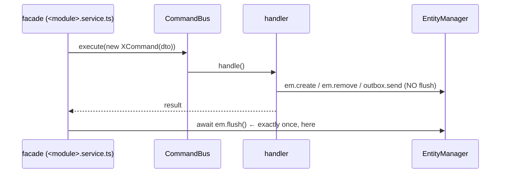

# CQRS — commands, queries, flush ownership

> Reviewed: `auth`, `post` (wave 1). Baseline: `src/modules/auth`.

## The split

| | Command | Query |
|---|---|---|
| Base class | `Command<TResult>` (`@nestjs/cqrs`) | `Query<TResult>` |
| Dispatched via | `commandBus.execute(new XCommand(dto, …ctx))` | `queryBus.execute(new XQuery(…))` |
| Handler | `@CommandHandler(X)` + `ICommandHandler` | `@QueryHandler(X)` + `IQueryHandler` |
| Registered in | `commandHandlers: []` in `<module>.module.ts` | `queryHandlers: []` |
| May mutate state? | **yes — that is the definition** | **no** |
| Identity map | default (writes are tracked) | `disableIdentityMap: true` for fresh reads |

**The split is behavioural, not flush-based.** Any state change is a Command —
even a read-shaped one. `resolveSession` slides the session's expiry, so it is a
Command, not a Query. Reference: `commands/resolve-session/resolve-session.handler.ts:19-24`.

## Flush ownership — the core rule



| # | Rule | Reference |
|---|---|---|
| Q1 | The **facade** calls `await this.em.flush()` exactly once, immediately after `commandBus.execute()`. | `auth.service.ts:29-33` |
| Q2 | Handlers **never** call `em.flush()`. | every `auth` handler |
| Q3 | Deferred writes use `em.create` / `em.persist` / `em.remove` (committed by the facade flush). | `services/session.service.ts:20` |
| Q4 | Jobs are enqueued with `OutboxSenderService.send(em, QueueName, data)` — staged in a `WeakMap`, drained on the flush's `afterFlush` so the enqueue rides the write transaction. | `commands/request-login-code/request-login-code.handler.ts:31-35`; `core/queue/outbox-sender.service.ts:20-53` |
| Q5 | Immediate writes (`em.upsert`, `em.nativeDelete`, raw `em.getConnection().execute`) are allowed inside a service when the semantics require it — they auto-commit and do **not** wait for the facade flush. Know that this breaks Q4 atomicity. | `services/challenge.service.ts:61,91` |
| Q6 | Command results are plain values/DTOs (`LoginResult`, `ResolvedSession`, `CardView`, `SubscriptionView`, `void`), never a managed entity. A shared result type lives in `<module>/types/*.type.ts` with a `to<View>(entity)` mapper. `AddCard` / `ReviewCard` / `ActivateMockSubscription` return views (Batch E); `IngestPostCommand` still returns a managed `Post` (owed). | `auth/types/login-result.type.ts`; `learning/types/card-view.type.ts`; `billing/types/subscription-view.type.ts` |

### Sanctioned exceptions to Q2

| Handler | Why it flushes | Reference |
|---|---|---|
| `AnnotatePostHandler` | flush-per-`PostPart` so a mid-job crash keeps completed parts (a part with `annotatedAt` set is skipped on retry). | PLAN §12; `commands/annotate-post/annotate-post.handler.ts` |
| `SpacyParsePostHandler` | same flush-per-`PostPart` pattern. | `commands/spacy-parse-post/spacy-parse-post.handler.ts:81` |

These two are the **only** sanctioned CQRS-handler exceptions. `assess-complexity`
/ `tag-grammar` / `generate-exercises` / `publish` / `retry` previously flushed
internally too — that was redundant with the facade re-flush and has been removed
(Batch A, D3).

### Flush outside the CQRS path

Two non-handler contexts legitimately own their own `em.flush()` — they have no
facade to defer to:

| Context | Why it flushes | Reference |
|---|---|---|
| Cron-poller services (`services/shared/*`) | flush-per-row for mid-batch durability; the `@Cron` host is a thin `CronJobHost` that just calls `service.run()`. Full rules in `queue-jobs.md` / `architecture.md` (D15). | `telegram/services/shared/{poll-updates,publish-pending,prune-telegram-updates}.service.ts` |
| **CLI importer inline seeding (D16)** | A thin one-off / seed importer script (PLAN §1) builds entities inline in the command's `execute()` and calls its own `em.flush()` — no domain service, no facade. Sanctioned for these seed commands; **do not** refactor them into `post` services. `post ingest` is different — it goes through `PostService.ingest`. | `entrypoints/cli/{grammar/grammar-import-egp,grammar/grammar-import-irregular-verbs,words/words-import-frequency}.command.ts` |

## Command constructor shape

`readonly dto` first, then any extra context (never re-derive it in the handler):

```ts
export class RequestLoginCodeCommand extends Command<void> {
  constructor(readonly dto: RequestLoginCodeDto, readonly ip: string) { super(); }
}
```

Reference: `commands/request-login-code/request-login-code.command.ts:5-10`.
