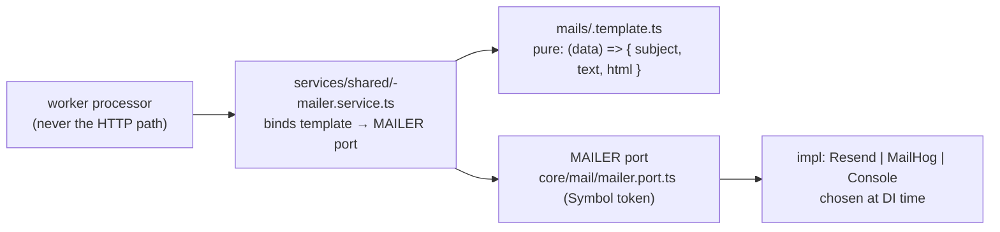

# Mail

> Reviewed: `core/mail`, `auth/mails` + `services/shared` (waves 1–2). See `REVIEW.md` D18.

## Shape

## Rules

| # | Rule | Reference |
|---|---|---|
| ML1 | Rendering is a **pure function** in `<module>/mails/<x>.template.ts` returning `{ subject, text, html }` — no side effects. | `auth/mails/challenge-email.template.ts:11-21` |
| ML2 | The `services/shared/<x>-mailer.service.ts` binds the template to the `MAILER` port and is invoked from a **worker processor**, never an HTTP path. | `auth/services/shared/challenge-mailer.service.ts` |
| ML3 | The mailer impl is chosen at DI time by `mailer.provider.ts`: `RESEND_API_KEY` set → Resend, else MailHog SMTP. | `core/mail/mailer.provider.ts:12-18` |
| ML4 | Structured params/results as named interfaces, not positional args. | `auth/services/shared/challenge-mailer.service.ts:5-8` |

## D18 — fallback (confirmed)

Change the no-key fallback from MailHog to **`ConsoleMailerService`** (logs a
clear warning); **throw at bootstrap in production** when neither a Resend key nor
an explicit MailHog opt-in is present. Today `ConsoleMailerService` exists but is
referenced nowhere, and a misconfigured prod silently drops mail into a dead SMTP.

## Fix owed (tests)

The `MAILER` port and `ChallengeMailerService` are **untested** in every tier —
auth ispecs assert only that the outbox job is staged. Add `test/fakes/mailer.fake.ts`
(D17) + a unit spec for template rendering.
