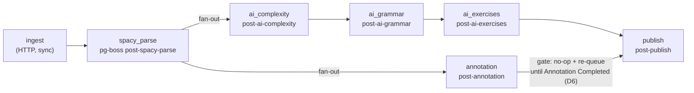

# Content pipeline — stages, idempotency, chaining

> Reviewed: `post` commands/queries + `core/queue` (wave 1). See also `references/queue-jobs.md`, `references/ai.md`, `references/nlp.md`.

## Stage DAG

- `ingest` / `retry` enqueue **only** `spacy_parse`.
- Each completing handler enqueues its successor via
  `OutboxSenderService.send(…, { singletonKey: postId })`, drained on `afterFlush`.
- `spacy_parse` fans out to **two branches** (`annotation`, `ai_complexity`).
  They rejoin at `publish`: `PublishPostHandler` no-ops and re-queues a delayed
  `post-publish` until `PostPipelineRun(stage=Annotation, status=Completed)`
  exists (D6). Reference: `commands/publish-post/publish-post.handler.ts`.
- There is **no** `fetch` stage — ingest takes pasted text synchronously (D7).
  `PostPipelineStage` starts at `SpacyParse`; the legacy `'fetch'` literal is
  still permitted by the `post_pipeline_runs_stage_check` constraint (a Batch D
  migration drops it).

## Rules

| # | Rule | Reference |
|---|---|---|
| P1 | **AI/LLM calls run only in a pg-boss processor.** No HTTP path, no query handler touches AI. | PLAN §12; `assess-complexity.processor.ts:13-15` |
| P2 | Each stage = one `QueueName`, one processor class, one per-stage NestJS `@Module` importing `PostModule`. | `entrypoints/worker/post/*.module.ts` |
| P3 | Idempotency key is `existingRun?.status === PostPipelineRunStatus.Completed` on the `(postId, stage)` `PostPipelineRun` row — checked first in `execute()`. **Not** "does a result exist in some other table". | `spacy-parse-post.handler.ts:55-61` |
| P3a | `JobWorkerHost` owns the run-row lifecycle around the handler (D4): it writes `Pending` + `startedAt` on stage entry and, on a caught throw, `Failed` + `errorMessage` + `retryCount++` — both on a **forked em / own transaction** so the failure survives the job's rollback. The handler still writes `Completed` itself. `Running` is derived (`startedAt` set, `completedAt` null), not an enum value. On pg-boss retry exhaustion (`retryCount >= retryLimit`) the host sets `PostStatus.Failed`. | `entrypoints/worker/job-worker-host.ts`; processors override `pipelineStage(job)` |
| P4 | Per-`PostPart` skip is the finer-grained guard inside a stage (part with `Sentence` rows / `annotatedAt` set is skipped), with flush-per-part. `/retry` clears these guards from scratch (see P10). | `spacy-parse-post.handler.ts:71-82` |
| P5 | All-or-nothing before any write: validate every char offset (`text.slice(start,end) === form`) and every annotation; the first bad one throws and aborts the whole job. | `domain/validate-annotations.ts:107-118`; `errors/nlp-offset-mismatch.error.ts` |
| P6 | "Gap-filler, not rewrite": check for an existing result before calling AI. Honoured at part-granularity by `spacy_parse`/`annotate`. | PLAN §12 |
| P7 | Rebuild-style stages `nativeDelete` prior output for the post/sentence, then re-persist. | `tag-grammar.handler.ts:91-93`; `generate-exercises.handler.ts:99` |
| P8 | Grammar tagging deliberately **drops-with-warn** (not all-or-nothing) for unknown slug / out-of-construction egpIndex / zero-token span. | `tag-grammar.handler.ts:251-279` (sanctioned, PLAN Зріз 3) |
| P9 | Downstream AI stages hard-fail if the spaCy layer is absent (`sentences.length === 0`); annotation throws typed `SpacyLayerMissingError`. | `assess-complexity.handler.ts:63-67` |
| P10 | `/retry` is always a **from-scratch reprocess** (D5): `RetryPostHandler` `nativeDelete`s `Sentence` / `SentenceToken` / `GrammarMatch` / `Exercise` for the post and nulls `PostPart.annotatedAt`, drops the `PostPipelineRun` rows, resets `posts.status`, and re-enqueues only `spacy_parse`. No `--force` flag. | `commands/retry-post/retry-post.handler.ts` |

## Known gaps (wave 1 — see `REVIEW.md`)

| Sev | Gap |
|---|---|
| low | P6 not honoured by the 3 downstream AI stages — they re-call the model on every non-`Completed` retry then wholesale overwrite. |

_Resolved in Batch C: `/retry` no-op (→ P10 / D5); no run-row on failure (→ P3a / D4);_
_`publish` not gated on `annotation` (→ Stage DAG note / D6)._
