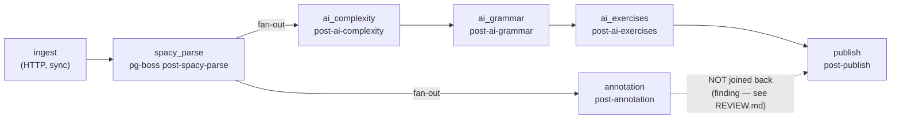

# Content pipeline — stages, idempotency, chaining

> Reviewed: `post` commands/queries + `core/queue` (wave 1). See also `references/queue-jobs.md`, `references/ai.md`, `references/nlp.md`.

## Stage DAG

- `ingest` / `retry` enqueue **only** `spacy_parse`.
- Each completing handler enqueues its successor via
  `OutboxSenderService.send(…, { singletonKey: postId })`, drained on `afterFlush`.
- `spacy_parse` fans out to **two independent branches** (`annotation`,
  `ai_complexity`); they never rejoin. Reference: `commands/spacy-parse-post/spacy-parse-post.handler.ts:95-106`.
- `PostPipelineStage.Fetch` has no handler (ingest is synchronous). See `REVIEW.md` open question 8.

## Rules

| # | Rule | Reference |
|---|---|---|
| P1 | **AI/LLM calls run only in a pg-boss processor.** No HTTP path, no query handler touches AI. | PLAN §12; `assess-complexity.processor.ts:13-15` |
| P2 | Each stage = one `QueueName`, one processor class, one per-stage NestJS `@Module` importing `PostModule`. | `entrypoints/worker/post/*.module.ts` |
| P3 | Idempotency key is `existingRun?.status === PostPipelineRunStatus.Completed` on the `(postId, stage)` `PostPipelineRun` row — checked first in `execute()`. **Not** "does a result exist in some other table". | `spacy-parse-post.handler.ts:55-61` |
| P4 | Per-`PostPart` skip is the finer-grained guard inside a stage (part with `Sentence` rows / `annotatedAt` set is skipped), with flush-per-part. | `spacy-parse-post.handler.ts:71-82` |
| P5 | All-or-nothing before any write: validate every char offset (`text.slice(start,end) === form`) and every annotation; the first bad one throws and aborts the whole job. | `domain/validate-annotations.ts:107-118`; `errors/nlp-offset-mismatch.error.ts` |
| P6 | "Gap-filler, not rewrite": check for an existing result before calling AI. Honoured at part-granularity by `spacy_parse`/`annotate`. | PLAN §12 |
| P7 | Rebuild-style stages `nativeDelete` prior output for the post/sentence, then re-persist. | `tag-grammar.handler.ts:91-93`; `generate-exercises.handler.ts:99` |
| P8 | Grammar tagging deliberately **drops-with-warn** (not all-or-nothing) for unknown slug / out-of-construction egpIndex / zero-token span. | `tag-grammar.handler.ts:251-279` (sanctioned, PLAN Зріз 3) |
| P9 | Downstream AI stages hard-fail if the spaCy layer is absent (`sentences.length === 0`); annotation throws typed `SpacyLayerMissingError`. | `assess-complexity.handler.ts:63-67` |

## Known gaps (wave 1 — see `REVIEW.md`)

| Sev | Gap |
|---|---|
| high | `/retry` deletes only `PostPipelineRun` rows → `spacy_parse` + `annotate` per-part guards (P4) still see old rows and no-op. A bad parse/annotation can't be recovered. |
| med | No handler writes `Failed` / `startedAt` / `errorMessage` / `retryCount` — a failed stage rolls back and leaves **no run row at all**. `post_pipeline_runs` is a "completed stages" log, not a run tracker. |
| med | `publish` doesn't gate on the `annotation` branch — a post goes feed-visible with word/phrase annotations possibly absent/failed. |
| low | P6 not honoured by the 3 downstream AI stages — they re-call the model on every non-`Completed` retry then wholesale overwrite. |
